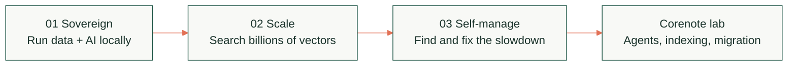

<div align="center">
  <a href="https://espc.tech/conference/fabcon-europe-2026/">
    
  </a>

# SQLCon Europe 2026 Demo Lab

**Live demos, deployment assets, and presenter guidance for the European Microsoft Fabric + SQL Community Conference.**

[](https://espc.tech/venue-faq-fabcon26/)
[](https://espc.tech/conference/fabcon-europe-2026/)
[](#the-story)

[Keynote demos](#keynote-demos) · [Corenote demos](#corenote-demos) · [Run with Copilot](#run-with-github-copilot) · [Start here](#start-here)

</div>

> **Any database. One data estate.**
>
> Follow the data from sovereign infrastructure, through mission-critical scale,
> to an estate that can detect and help fix its own problems.

## The story



## Keynote demos

| Act | Live story | Technology | Enter the demo |
|:---:|---|---|---|
| **01** | **Sovereign Private Cloud**<br>Run data and AI on organization-controlled infrastructure. | SQL Server 2025 · Azure Local · Foundry Local | **[Open Demo 1 →](demo1-azure-local)** |
| **02** | **Mission-Critical, at Any Scale**<br>Search evidence with native vectors, then scale reads without changing the app. | Azure SQL Hyperscale · DiskANN · named replicas | **[Open Demo 2 →](demo2-mission-critical)** |
| **03** | **Your Data Estate Running Itself**<br>Follow estate-wide signals from a slow screen to a concrete fix. | Azure SQL · Fabric · operational intelligence | **[Open Demo 3 →](demo3-estate-running-itself)** |

> Demos 2 and 3 are two acts of one Caldova story. The application and visual
> language stay constant while the lens moves from application scale to estate operations.

## Corenote demos

| Experience | What you will see | Start here |
|---|---|---|
| **Caldova Evidence Agent** | A grounded biomedical research agent using Azure SQL, SQL MCP Server, and Microsoft Foundry. | [Build the investigation](corenote/caldovaevidenceagent) |
| **Caldova Hands-Free Indexing** | Automatic indexing and Automatic Index Compaction on Azure SQL Database Hyperscale. | [Watch the index evolve](corenote/handsfreeindexing) |
| **Nandiyo Logistics migration lab** | An end-to-end SQL Server and ASP.NET Core migration to Azure SQL and App Service. | [Run the migration](corenote/migration) |
| **SSMS What's New** | Reproducible feature demos, storyboards, SQL assets, and presenter guidance. | [Explore SSMS](corenote/ssms-whatsnew) |
| **One Connection String to Rule Them All** | The drivers and code behind the corenote connectivity segment. | [Compare the drivers](corenote/drivers) |

Browse the complete **[corenote collection →](corenote)**.

## Run with GitHub Copilot

Open the repository in VS Code, start GitHub Copilot Chat in **Agent** mode,
and let the checked-in runbooks drive the work.

<table>
<tr>
<td width="50%" valign="top">

### Slash-command routes

Type `/` and choose:

```text
/prepare-keynote-demo-1
/rehearse-keynote-demo-1
/prepare-handsfree-indexing
/rehearse-handsfree-indexing
```

</td>
<td width="50%" valign="top">

### Natural-language routes

Ask Copilot to:

- [Build or verify the Evidence Agent](.github/skills/build-caldova-evidence-agent/SKILL.md)
- [Start or check the Evidence Agent](.github/skills/run-caldova-evidence-agent/SKILL.md)
- [Guide the Evidence Agent demo](.github/skills/demo-caldova-evidence-agent/SKILL.md)

</td>
</tr>
</table>

The repository skills use the current scripts, protect credentials, and pause
before elevated, billable, data-changing, or destructive work.

## Start here

1. **Pick a story** from the tables above.
2. **Open its README** for prerequisites, deployment, validation, and cleanup.
3. **Use the runbook** before presenting or changing Azure resources.
4. **Clean up** billable resources when the demo is complete.

<details>
<summary><strong>Repository map</strong></summary>

| Path | What lives there |
|---|---|
| [demo1-azure-local](demo1-azure-local) | Keynote Demo 1 app, database, setup, and cloud variant |
| [demo2-mission-critical](demo2-mission-critical) | Keynote Demo 2 app, data pipeline, workload, and scripts |
| [demo3-estate-running-itself](demo3-estate-running-itself) | Keynote Demo 3 app, database, and presenter guidance |
| [corenote](corenote) | Corenote demo packages and workshops |
| [shared](shared) | Shared design system and reusable guidance |

</details>

---

Event details and hero image link to the
[official FabCon + SQLCon Europe 2026 website](https://espc.tech/conference/fabcon-europe-2026/).
See [CONTRIBUTING.md](CONTRIBUTING.md) before changing shared assets or adding a
demo. Report suspected vulnerabilities according to [SECURITY.md](SECURITY.md).
