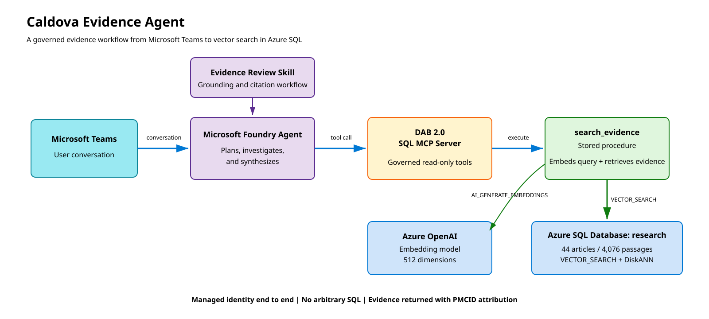

# Caldova Evidence Agent

## Proposal

Turn the Caldova biomedical search experience from Demo 2 into a conversational evidence agent. The new demo keeps retrieval deterministic in Azure SQL, exposes that retrieval through Data API builder's SQL MCP Server, lets a Microsoft Foundry agent plan and synthesize an investigation, and publishes the agent to Microsoft Teams.

## Keynote story

> SQL retrieves the evidence. The agent decides what to investigate, connects the evidence, identifies uncertainty, and continues the research conversation in Teams.

The demo is intentionally about the agent experience, not vector scale. It uses a small curated corpus and shows the shortest credible path from a natural-language question to a grounded, multi-source answer.

## Architecture

[Open the SVG](architecture.svg) | [Edit the Excalidraw source](architecture.excalidraw)

The Foundry agent can use additional MCP servers later. For example, Azure MCP Server could report deployment health while SQL MCP Server retrieves biomedical evidence. The MVP needs only the SQL MCP endpoint.

## Data plan

Create a new Azure SQL Database deployment in a new resource group and logical server. Keep the database name `research` and reuse the Demo 2 corpus shape:

- `dbo.pmc_documents`
- `dbo.pmc_chunks`
- Article title and PMCID metadata
- Pre-segmented passage text
- A vector column and DiskANN vector index

The staged Demo 2 package contains everything needed to rebuild the curated corpus:

- 44 articles
- 4,076 passages
- No missing passage text
- Passage lengths between 149 and 768 characters
- Fifteen existing evaluation questions and expected article coverage

Do not reuse the existing Potion vectors. Register one embedding model as an Azure SQL `EXTERNAL MODEL`, then regenerate every stored passage embedding with `AI_GENERATE_EMBEDDINGS`. Query embeddings must use the same model and dimensions as stored embeddings.

A practical choice is `text-embedding-3-small` configured for 512 dimensions, allowing the existing `VECTOR(512)` column shape to remain. Model availability, deployment capacity, and the 512-dimension response must be validated before loading the corpus.

The source passages are already appropriately segmented, so this demo does not require the original PMC XML or `AI_GENERATE_CHUNKS`.

## SQL retrieval contract

Place the search behavior behind stored procedures. DAB 2.0 exposes each procedure as a named MCP custom tool, so the agent never generates SQL or receives direct database access.

### `search_evidence`

Inputs:

- `question`: natural-language biomedical question
- `top_k`: requested result count with a conservative maximum

Behavior:

1. Validate the inputs.
2. Generate a query vector with `AI_GENERATE_EMBEDDINGS`.
3. Fail clearly if the embedding call returns `NULL`.
4. Run `VECTOR_SEARCH` with cosine distance.
5. Collapse results to one passage per article.
6. Return the passage, neighboring context, title, PMCID, chunk number, and distance.

### `get_article_context`

Returns additional passages around a selected article and chunk when the initial evidence is incomplete.

### `get_corpus_status`

Returns the corpus version, article and passage counts, embedding model, vector dimensions, and vector-index readiness.

Only the first stored-procedure result set is returned by DAB, so each procedure must expose one stable result shape. Grant the DAB database identity only `EXECUTE` on these procedures. Do not expose generic create, update, or delete tools, arbitrary SQL, or the embedding column.

## DAB SQL MCP Server

Use Data API builder 2.0 or later with MCP enabled. Configure the procedures as custom tools with clear descriptions so the model knows when to invoke each one.

The SQL MCP endpoint is the governed data boundary:

- Streamable HTTP for Foundry connectivity
- Microsoft Entra authentication
- Role-based authorization
- No raw SQL generation
- No write operations
- OpenTelemetry traces for MCP calls

SQL MCP Server is a capability of Data API builder; it is not a separate custom service that needs to be written.

## Agent behavior

Use a Microsoft Foundry agent named **Caldova Evidence Agent**. The agent should:

1. Interpret the user's research goal.
2. Break broad requests into focused subquestions.
3. Search separately for each important concept.
4. Select evidence from distinct articles.
5. retrieve more context when a passage is incomplete.
6. Compare mechanisms, agreement, disagreement, and limitations.
7. Cite every material claim with a PMCID link.
8. Distinguish direct evidence from synthesis.
9. Say when the corpus does not contain enough evidence.
10. Avoid diagnosis and individual treatment recommendations.

The model should not expose vectors, SQL, hidden reasoning, credentials, or internal tool parameters.

## Evidence review skill

Foundry Agent Skills are currently a preview feature. A reusable `biomedical-evidence-review` skill can hold the investigation workflow instead of embedding all behavior in one system prompt.

The skill should instruct the agent to:

- Decompose comparative or broad questions.
- Use at least three distinct articles when available.
- Retrieve surrounding context before interpreting an incomplete passage.
- Identify corroboration and disagreement.
- Separate findings, synthesis, limitations, and next questions.
- Cite claims with PMCID links.
- Refuse to invent evidence when retrieval is insufficient.

For the keynote, keep equivalent instructions in the agent definition as a fallback. The demo must still work if the preview skill or Toolbox path is unavailable.

## Agentic demonstration

Start with a request that requires planning rather than a single search:

> Prepare a three-source evidence briefing on how intestinal microbiome disruption may influence anxiety and depression. Identify the proposed mechanisms, explain where the studies agree or differ, note important limitations, and recommend the next research question.

The expected agent behavior is multiple calls to `search_evidence`, followed by targeted `get_article_context` calls and a cited synthesis.

Then ask a conversational follow-up:

> Compare those findings with the evidence on chronic psychological stress. Is inflammation a shared mechanism?

This demonstrates decomposition, repeated tool use, evidence comparison, conversational continuity, and grounded synthesis.

## Teams experience

After testing the stable Foundry agent version, publish it directly through **Teams and Microsoft 365 Copilot**. Begin with the **Just you** scope for rehearsal, which does not require tenant-wide approval.

Foundry handles the Azure Bot Service connection, Activity protocol, Teams manifest, packaging, and routing to the stable agent endpoint. A separate Teams backend is not required for the MVP.

Directly published agents currently do not provide streaming or native citation objects. Render PMCID references as ordinary clickable links. Use Microsoft 365 Agents Toolkit later only if the demo requires Adaptive Cards, a custom source panel, or richer citation rendering.

## Security and identity

Use managed identities throughout:

1. Teams sends the conversation to the published Foundry agent.
2. The Foundry agent identity authenticates to the protected DAB MCP endpoint.
3. The DAB workload identity connects to Azure SQL.
4. The database identity can execute only the approved read-only procedures.
5. Azure SQL authenticates to the embedding endpoint through its configured external-model credential.

No database password, model API key, or shared application secret should appear in source control.

## Evaluation

Reuse the fifteen Demo 2 questions as the retrieval regression set. Add agent-level tests for:

- Correct MCP tool selection
- Multiple searches for broad or comparative requests
- At least two or three distinct sources when available
- Every factual claim traceable to returned evidence
- No invented articles or PMCIDs
- Appropriate insufficient-evidence behavior
- Correct handling of follow-up questions
- Teams installation and conversation smoke tests
- Retained latency measurements before any timing is quoted on stage

## Implementation sequence

1. Provision the new Azure SQL logical server and `research` database.
2. Deploy the corpus schema without loading the old vectors.
3. Configure the external embedding model and verify a single 512-dimensional result.
4. Load the 44 articles and 4,076 passage texts.
5. Generate passage embeddings in controlled batches with retry handling.
6. Create and verify the DiskANN vector index.
7. Implement and test the three stored procedures directly in SQL.
8. Configure DAB 2.0 and verify its MCP `tools/list` and `tools/call` behavior.
9. Create the Foundry agent and connect the SQL MCP server.
10. Add the evidence-review instructions or skill.
11. Run retrieval and agent evaluations.
12. Publish privately to Teams and rehearse the exact stage conversation.
13. Capture a fallback recording after the live contract passes.

## MVP boundary

The first version deliberately excludes:

- The large-corpus scale comparison
- Hybrid full-text retrieval
- Database write operations
- Arbitrary SQL or NL-to-SQL
- A custom Teams frontend
- Multi-agent orchestration
- Automated clinical recommendations

These can be added only after the single-agent, read-only evidence workflow is stable and measurable.
