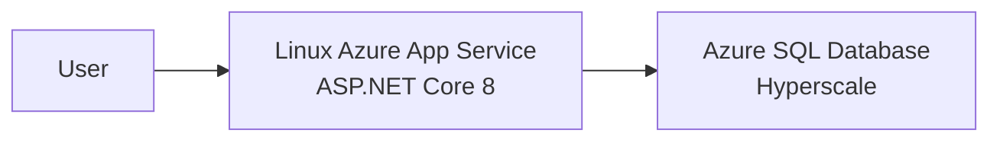

# Nandiyo end-to-end Azure migration workshop

This guide reproduces the migration of an ASP.NET Core 8 MVC application and its SQL
Server database to Linux Azure App Service and Azure SQL Database Hyperscale.

The workflow is intentionally gated: assess first, review the proposed changes, then
remediate, provision, migrate, deploy, validate, and clean up.

## Architecture



Azure SQL permits only Microsoft Entra authentication. The migration operator uses
Entra authentication for the BACPAC import, and App Service uses its system-assigned
managed identity at runtime. No SQL login or password is required.

> [!WARNING]
> This lab creates billable resources. The Bicep template also enables public network
> access and the Azure-services firewall rule for a simple workshop path. Use a
> nonproduction subscription and delete the resource group when finished.

## 1. Prerequisites

Use Windows because the source uses SQL Server LocalDB.

Install:

- Git
- .NET 8 SDK
- SQL Server LocalDB
- Azure CLI with Bicep
- SqlPackage
- `sqlcmd` or the SQL Server extension for Visual Studio Code
- Visual Studio Code with GitHub Copilot and the .NET modernization tooling if you
  want to reproduce the guided assessment

You also need:

- Permission to create a resource group, App Service plan, web app, Azure SQL logical
  server, firewall rules, and database
- Permission to configure a Microsoft Entra administrator for Azure SQL
- Permission to read the App Service managed identity's service principal

Verify the command-line tools:

```powershell
dotnet --version
az version
az bicep version
SqlPackage /Version
sqlcmd -?
```

Clone the repository and enter the lab:

```powershell
git clone https://github.com/amthomas46/sqlcon-eu-2026-demos.git
$repoRoot = Resolve-Path .\sqlcon-eu-2026-demos
Set-Location (Join-Path $repoRoot 'corenote\migration')
```

## 2. Recreate the original baseline

The default branch contains the completed migration. To repeat the assessment against
the original source, create a separate worktree from the baseline tag:

```powershell
$baselineRoot = Join-Path (Split-Path $repoRoot) 'sqlcon-migration-baseline'
git -C $repoRoot worktree add $baselineRoot corenote-migration-baseline
Set-Location (Join-Path $baselineRoot 'corenote\migration')
```

Build and start the baseline:

```powershell
dotnet restore FictionalOps.sln
dotnet build FictionalOps.sln --configuration Release
dotnet run --project src\FictionalOps.Web
```

Open the displayed local URL and verify:

1. Create an order.
2. Advance an order in Fulfillment.
3. Review Inventory.
4. Open a Partner account.

Stop the application with <kbd>Ctrl</kbd>+<kbd>C</kbd>, then create the intentional
SQL Server compatibility findings:

```powershell
sqlcmd `
  -S '(localdb)\MSSQLLocalDB' `
  -E -b `
  -i database\legacy-cross-database-reporting.sql
```

This creates `OpsFinance.dbo.RegionTaxRates`, a cross-database reporting view in
`Operations`, and the `dbo.porter.Next` compatibility issue.

## 3. Assess before changing anything

### Application assessment

In the Upgrade/App Modernization experience, use Guided mode:

> Migrate this ASP.NET Core 8 MVC application to Azure App Service and its SQL Server
> database to Azure SQL Database Hyperscale. Use Guided mode. Assess first and wait for
> my approval. Evaluate scale-out state, configuration, health, authentication, SQL
> dependencies, and deployment readiness.

The expected application finding is:

- In-memory session is process-local and unreliable when App Service scales out.
- The only session value, `LastOrderId`, is never read.
- The application has no App Service health endpoint.

The intended remediation is limited to removing the unused session dependency, adding
`/health`, and configuring the App Service health-check path.

### Database assessment

Connect to `(localdb)\MSSQLLocalDB`, select `Operations`, and run:

```powershell
sqlcmd `
  -S '(localdb)\MSSQLLocalDB' `
  -d Operations `
  -E -b `
  -i database\assessment\azure-sql-readiness.sql
```

The expected Azure SQL Database findings are:

| Finding | Why it matters |
|---|---|
| `dbo.vw_OrderRegionalTax` references `OpsFinance.dbo.RegionTaxRates` | Azure SQL Database does not support this SQL Server-style cross-database dependency |
| Service Broker is enabled on `Operations` | Service Broker is not supported by Azure SQL Database |
| `dbo.porter.Next` exists | `Next` can conflict with `NEXT VALUE FOR` parsing |

The least disruptive solution is to copy the five-row reference table into
`Operations` and rewrite the view. Elastic query would add credentials and operational
complexity; moving the report to analytics would require a new ingestion and
synchronization design.

## 4. Apply the completed remediation

Return to the current branch's migration directory. The commands below assume it is
the original clone:

```powershell
Set-Location (Join-Path $repoRoot 'corenote\migration')
```

Keep the local application stopped, then run the idempotent remediation:

```powershell
sqlcmd `
  -S '(localdb)\MSSQLLocalDB' `
  -E -b `
  -i database\remediation\hyperscale-compatible-reporting.sql
```

Expected output:

```text
TaxRateCount                  5
ViewRowCount                  60
CrossDatabaseDependencyCount 0
ServiceBrokerEnabled         0
NextColumnCount              0
NextStepColumnCount          1
```

The script:

- Disables Service Broker
- Renames `dbo.porter.Next` to `NextStep`
- Copies the five authoritative tax rows into `Operations`
- Rewrites `dbo.vw_OrderRegionalTax` to use the local table
- Rolls back its transactional schema/data/view changes if validation fails

Build the remediated application:

```powershell
dotnet restore FictionalOps.sln
dotnet build FictionalOps.sln --configuration Release
az bicep build --file infra\main.bicep --stdout | Out-Null
```

The completed application removes in-memory session, exposes `/health`, and uses
`en-US` request culture so currency renders consistently on Linux.

## 5. Set deployment variables

Choose unique names and your target Azure region:

```powershell
$resourceGroup = 'rg-nandiyo-lab'
$location = 'eastus'
$prefix = 'nandiyo'
$deploymentName = "nandiyo-$(Get-Date -Format 'yyyyMMddHHmmss')"
$artifactRoot = Join-Path $env:USERPROFILE 'SqlMigration\Bacpac'
$bacpacPath = Join-Path $artifactRoot 'Operations.bacpac'
```

Authenticate and select the intended subscription:

```powershell
az login
az account list --output table
az account set --subscription '<subscription-id-or-name>'
az account show --output table
```

Resolve the signed-in Entra administrator:

```powershell
$entraAdminLogin = az account show --query user.name -o tsv
$entraAdminObjectId = az ad signed-in-user show --query id -o tsv
```

Determine the workstation's public IPv4 address using a trusted method approved by
your organization, then set it without committing it:

```powershell
$clientIpAddress = '<your-public-ipv4-address>'
```

## 6. Preview and provision Azure

Create the resource group:

```powershell
az group create --name $resourceGroup --location $location
```

Preview the deployment:

```powershell
az deployment group what-if `
  --resource-group $resourceGroup `
  --template-file infra\main.bicep `
  --parameters prefix=$prefix `
    entraAdminLogin=$entraAdminLogin `
    entraAdminObjectId=$entraAdminObjectId `
    createDatabase=false `
    clientIpAddress=$clientIpAddress
```

Provision after reviewing the preview:

```powershell
az deployment group create `
  --name $deploymentName `
  --resource-group $resourceGroup `
  --template-file infra\main.bicep `
  --parameters prefix=$prefix `
    entraAdminLogin=$entraAdminLogin `
    entraAdminObjectId=$entraAdminObjectId `
    createDatabase=false `
    clientIpAddress=$clientIpAddress
```

Capture the outputs:

```powershell
$outputs = az deployment group show `
  --name $deploymentName `
  --resource-group $resourceGroup `
  --query properties.outputs | ConvertFrom-Json

$appUrl = $outputs.appUrl.value
$appName = $outputs.webAppName.value
$appPrincipalId = $outputs.webAppPrincipalId.value
$sqlServerName = $outputs.sqlServerName.value
$sqlServerFqdn = $outputs.sqlServerFqdn.value
```

`createDatabase=false` is intentional: the BACPAC import creates `Operations`.

## 7. Export the source BACPAC

Ensure the local application is stopped. Do not restart it until the migration is
accepted or you decide to roll back.

Create a private artifact directory:

```powershell
New-Item -ItemType Directory -Path $artifactRoot -Force | Out-Null
if (Test-Path $bacpacPath) {
  throw "Refusing to overwrite existing BACPAC: $bacpacPath"
}
```

Export:

```powershell
$sourceConnection = 'Server=(localdb)\MSSQLLocalDB;Initial Catalog=Operations;Integrated Security=True;TrustServerCertificate=True;'

SqlPackage `
  /Action:Export `
  "/SourceConnectionString:$sourceConnection" `
  "/TargetFile:$bacpacPath" `
  /OverwriteFiles:False `
  /p:VerifyExtraction=True `
  /p:CommandTimeout=1800

Get-Item $bacpacPath
Get-FileHash $bacpacPath -Algorithm SHA256
```

Do not commit the BACPAC.

## 8. Import as Hyperscale

Confirm that the target database does not already exist:

```powershell
$existingDatabase = az sql db list `
  --resource-group $resourceGroup `
  --server $sqlServerName `
  --query "[?name=='Operations'].name" -o tsv

if ($existingDatabase) {
  throw 'Operations already exists on the target. Import was not started.'
}
```

Acquire an Azure SQL token in memory and import:

```powershell
$sqlAccessToken = az account get-access-token `
  --resource 'https://database.windows.net/' `
  --query accessToken -o tsv

$targetConnection = "Server=tcp:$sqlServerFqdn,1433;Initial Catalog=Operations;Encrypt=True;TrustServerCertificate=False;Connection Timeout=30;"

SqlPackage `
  /Action:Import `
  "/SourceFile:$bacpacPath" `
  "/TargetConnectionString:$targetConnection" `
  "/AccessToken:$sqlAccessToken" `
  /p:DatabaseEdition=Hyperscale `
  /p:DatabaseServiceObjective=HS_Gen5_2 `
  /p:DatabaseMaximumSize=32 `
  /p:CommandTimeout=1800
```

This lab uses license-included pricing and does not apply Azure Hybrid Benefit to the
Hyperscale database. General Purpose can be a less expensive alternative in scenarios
where an organization continues maintaining qualifying licenses. Hyperscale is used
here for its purchasing flexibility and its ability to scale from small configurations
to very large workloads.

Verify the target:

```powershell
az sql db show `
  --resource-group $resourceGroup `
  --server $sqlServerName `
  --name Operations `
  --query '{status:status,tier:sku.tier,objective:currentServiceObjectiveName,capacity:sku.capacity}' `
  --output table
```

Expected values are `Online`, `Hyperscale`, `HS_Gen5_2`, and `2`.

## 9. Grant the App Service managed identity

Azure SQL requires the system-assigned identity's application/client ID when creating
an Entra database principal with an explicit SID:

```powershell
$appClientId = az ad sp show --id $appPrincipalId --query appId -o tsv
$appSid = '0x' + ((([guid]$appClientId).ToByteArray() |
  ForEach-Object { $_.ToString('x2') }) -join '')

$appName
$appSid
```

Connect to the imported `Operations` database as the Entra administrator using the
SQL Server extension, SSMS, or another MFA-capable client. Replace the two placeholders
and execute:

```sql
DECLARE @appName sysname = N'<app-service-name>';
DECLARE @appSid varchar(34) = '<0x-client-id-as-sql-sid>';
DECLARE @statement nvarchar(max);

IF NOT EXISTS
(
    SELECT 1
    FROM sys.database_principals
    WHERE name = @appName
)
BEGIN
    SET @statement = N'CREATE USER ' + QUOTENAME(@appName)
        + N' WITH SID = ' + @appSid + N', TYPE = E;';
    EXEC sys.sp_executesql @statement;
END;

SET @statement = N'ALTER ROLE db_datareader ADD MEMBER ' + QUOTENAME(@appName) + N';';
IF NOT EXISTS
(
    SELECT 1
    FROM sys.database_role_members AS members
    INNER JOIN sys.database_principals AS roles
        ON roles.principal_id = members.role_principal_id
    INNER JOIN sys.database_principals AS principals
        ON principals.principal_id = members.member_principal_id
    WHERE roles.name = N'db_datareader'
      AND principals.name = @appName
)
    EXEC sys.sp_executesql @statement;

SET @statement = N'ALTER ROLE db_datawriter ADD MEMBER ' + QUOTENAME(@appName) + N';';
IF NOT EXISTS
(
    SELECT 1
    FROM sys.database_role_members AS members
    INNER JOIN sys.database_principals AS roles
        ON roles.principal_id = members.role_principal_id
    INNER JOIN sys.database_principals AS principals
        ON principals.principal_id = members.member_principal_id
    WHERE roles.name = N'db_datawriter'
      AND principals.name = @appName
)
    EXEC sys.sp_executesql @statement;
```

## 10. Validate the migrated database

Run this against the Azure `Operations` database:

```sql
SELECT
    CustomerCount = (SELECT COUNT(*) FROM dbo.Customers),
    ProductCount = (SELECT COUNT(*) FROM dbo.Products),
    OrderCount = (SELECT COUNT(*) FROM dbo.Orders),
    OrderItemCount = (SELECT COUNT(*) FROM dbo.OrderItems),
    TaxRateCount = (SELECT COUNT(*) FROM dbo.RegionTaxRates),
    TaxViewRowCount = (SELECT COUNT(*) FROM dbo.vw_OrderRegionalTax),
    CrossDatabaseDependencyCount =
    (
        SELECT COUNT(*)
        FROM sys.sql_expression_dependencies
        WHERE referenced_database_name IS NOT NULL
    ),
    NextColumnCount =
    (
        SELECT COUNT(*)
        FROM sys.columns
        WHERE object_id = OBJECT_ID(N'dbo.porter')
          AND name = N'Next'
    ),
    NextStepColumnCount =
    (
        SELECT COUNT(*)
        FROM sys.columns
        WHERE object_id = OBJECT_ID(N'dbo.porter')
          AND name = N'NextStep'
    );
```

Before application testing, expect 18 customers, 24 products, 60 orders, 120 order
items, five tax rows, a nonzero tax-view count, zero cross-database dependencies,
zero `Next` columns, and one `NextStep` column.

## 11. Remove temporary migration access

After the import and validation succeed:

```powershell
az sql server firewall-rule delete `
  --resource-group $resourceGroup `
  --server $sqlServerName `
  --name AllowMigrationClient
```

Verify it is gone:

```powershell
az sql server firewall-rule list `
  --resource-group $resourceGroup `
  --server $sqlServerName `
  --query "[?name=='AllowMigrationClient'].name" -o tsv
```

The command should return no value.

## 12. Publish and deploy the application

```powershell
$publishDirectory = Join-Path $env:TEMP 'nandiyo-publish'
$packagePath = Join-Path $env:TEMP 'nandiyo-publish.zip'

Remove-Item -LiteralPath $publishDirectory -Recurse -Force -ErrorAction SilentlyContinue
Remove-Item -LiteralPath $packagePath -Force -ErrorAction SilentlyContinue

dotnet publish `
  src\FictionalOps.Web\FictionalOps.Web.csproj `
  --configuration Release `
  --output $publishDirectory

Compress-Archive `
  -Path "$publishDirectory\*" `
  -DestinationPath $packagePath

az webapp deploy `
  --resource-group $resourceGroup `
  --name $appName `
  --src-path $packagePath `
  --type zip
```

If App Service reports `Login failed for user '<token-identified principal>'`, verify
that the contained user's SID was generated from `$appClientId`, not
`$appPrincipalId`.

## 13. Validate the application

Check the health endpoint:

```powershell
Invoke-WebRequest "$appUrl/health"
```

Open `$appUrl` and verify:

1. Dashboard loads and currency values use `$`.
2. Fulfillment loads.
3. Inventory loads.
4. Partners loads.
5. Create an order.
6. Advance the new order from Submitted to Processing.

The write test should increase both the order and order-item counts by one.

## 14. Acceptance and cleanup

Retain the source database and BACPAC until the migration is accepted. After
acceptance, remove local artifacts:

```powershell
Remove-Item -LiteralPath $publishDirectory -Recurse -Force -ErrorAction SilentlyContinue
Remove-Item -LiteralPath $packagePath -Force -ErrorAction SilentlyContinue
Remove-Item -LiteralPath $bacpacPath -Force -ErrorAction SilentlyContinue
```

To remove every Azure resource created by the lab:

```powershell
az group delete --name $resourceGroup
```

Review the resource group name carefully before confirming deletion.

## Troubleshooting

### App Service health check times out

Download startup logs:

```powershell
az webapp log download `
  --resource-group $resourceGroup `
  --name $appName `
  --log-file (Join-Path $env:TEMP 'nandiyo-logs.zip')
```

Check database authentication first. The application accesses the database during
startup to validate and update seed data.

### Currency displays as `¤`

Linux did not resolve a currency-specific culture. Confirm the completed
[Program.cs](../src/FictionalOps.Web/Program.cs) configures `en-US` request
localization before routing.

### BACPAC import says the target exists

Do not overwrite it automatically. Confirm that the database belongs to this lab,
delete it deliberately if appropriate, and rerun the import.

### LocalDB alias is not recognized

Some modern tools do not resolve `(localdb)\MSSQLLocalDB`. Run:

```powershell
sqllocaldb info MSSQLLocalDB
```

Use the reported `Instance pipe name` as the source server for that tool.
