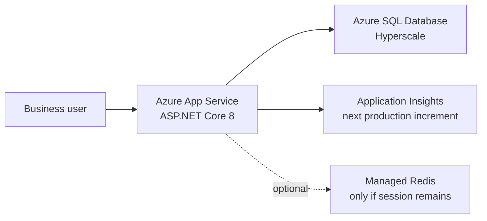

# Nandiyo: one-hour Azure modernization workshop

## Workshop outcome

In this demo  use GitHub Copilot's Upgrade/App Modernization experience
and SQL tooling to assess a working ASP.NET Core and SQL Server application, explain
the findings, remediate one application issue and one database issue, provision Azure
App Service plus Azure SQL Database Hyperscale, migrate the database, deploy the app,
and validate four business workflows.

The exercise is intentionally a **replatform with targeted modernization**, not a .NET
version upgrade. VelaForge already targets .NET 8. In the Upgrade agent, say **migrate
to Azure** so the installed `azure-migrate` scenario starts the dedicated application
modernization session. A generic "upgrade this app" prompt may select only the
`dotnet-version-upgrade` scenario and miss the cloud-readiness work.


## Facilitator preparation (before the workshop)

### Required tools and access

- Visual Studio Code with GitHub Copilot Chat and the .NET Upgrade/App Modernization
  extension installed.
- SQL Server (`mssql`) extension and its Azure SQL migration/assessment experience.
- C# Dev Kit
- .NET 8 SDK, Azure CLI with Bicep, `sqlcmd`, and `SqlPackage` on `PATH`.
- An Azure subscription where you  can create a resource group, App Service,
  and Azure SQL logical server/database.
- A Microsoft Entra account allowed to deploy resources. Never send passwords, tokens,
  or connection strings through Copilot Chat.

Verify tools without changing the project:

```powershell
dotnet --version
az version
az bicep version
sqlcmd --version
SqlPackage /Version
```

### Source layout


```text
Unzip the folder and place it in an empty directory. Eg: C:\'<folder-name>'

```
Optional - 
For a team workshop, publish the same baseline to a training repository and tag it
`workshop-start`. Keep a private `workshop-finished` branch as the emergency fallback.

Open the folder in VScode and Add Folder to workspace.

### Verify the intentional findings

The baseline must retain both issues:

- **APP-001:** `Program.cs` uses in-memory session, and `OrdersController.Create`
  writes `LastOrderId` to that session.
- **DB-001:** `dbo.vw_OrderRegionalTax` joins
  `OpsFinance.dbo.RegionTaxRates` through a three-part name.

1. Start the app once so EF creates and seeds `Operations`, then install the legacy view:

```powershell
dotnet run --project src/FictionalOps.Web --urls http://127.0.0.1:5190
```


2. Run `database/legacy-cross-database-reporting.sql` from the SQL Server extension against
LocalDB. Stop the app, then verify the baseline:

### Load the Database Skills

1. In the chat, type  `load the skills`
2. Wait for the message Loaded SQL Migration Skills 


```powershell
dotnet build FictionalOps.sln --configuration Release
az bicep build --file infra/main.bicep --stdout | Out-Null
```

### Reliability option for a 60-minute event

Azure provisioning can vary. For a guaranteed finish, deploy the empty infrastructure
the day before and keep its resource group. During the workshop, validate and explain
the Bicep, then use `az deployment group what-if` or show the completed deployment.
Use live provisioning only when the subscription and region have already been tested.

## Target architecture



The workshop deployment uses SQL administrator credentials to keep the live exercise
short. Treat this as an intermediate migration state. Managed identity, private
networking, Key Vault, deployment slots, telemetry, and CI/CD are closing roadmap items.

---

## 00-05: establish the baseline

Open `C:\workshop`, build, and start the application:

```powershell
Set-Location C:\workshop
dotnet build FictionalOps.sln --configuration Release
dotnet run --project src/FictionalOps.Web --urls http://127.0.0.1:5190
```

At `http://127.0.0.1:5190`, demonstrate:

1. Create an order.
2. Advance an order in **Fulfillment**.
3. Review **Inventory** risk.
4. Open a **Partner 360** account.

Say: "The application is healthy. Our question is whether its operating assumptions
remain safe after we move from one local process and one SQL Server instance to managed,
elastic Azure services."


## 05-15: run the application assessment with Upgrade


### Start the correct scenario

Open Copilot Chat, select the **Upgrade** agent, and submit:

> Migrate this ASP.NET Core 8 MVC application to Azure App Service and its SQL Server
> database to Azure SQL Database Hyperscale. Use Guided mode. Assess first and do not
> modify files until I approve the plan. Evaluate scale-out state, configuration,
> health, observability, authentication, SQL dependencies, and deployment readiness.

Expected behavior:

1. Upgrade matches the `azure-migrate` scenario.
2. The scenario starts a dedicated App Modernization migration session.
3. The migration session analyzes architecture, proposes Azure targets, creates a plan,
   and asks for confirmation before execution.

If Upgrade proposes only **.NET version upgrade**, cancel and repeat the prompt with
the explicit phrase **migrate to Azure App Service**. This repository is already on
.NET 8, so framework upgrade is not the workshop objective.

Ask Copilot for the plan:

> Propose the smallest ordered remediation plan that preserves all four workflows.
> Separate critical fixes from production-hardening recommendations. Include
> a build and HTTP validation after the application changes.

Approve only these workshop-critical application changes:

1. Remove the unused local session dependency.
2. Add ASP.NET Core health checks and `/health`.
3. Keep local development configuration, but use App Service settings in Azure.
4. Update Bicep with an App Service health-check path if proposed.

## 15-24: assess SQL Server with SQL skills

### Connect and inventory

In the SQL Server extension, create a connection to:

```text
Server: (localdb)\MSSQLLocalDB
Authentication: Windows / Integrated
Database: Operations
Encrypt: Optional for LocalDB only
```

> Assess the SQL database Operations and OpsFinance


The deterministic result is **DB-001**:

```text
dbo.vw_OrderRegionalTax
  -> OpsFinance.dbo.RegionTaxRates
```
recommendations.

Blocking evidence for Azure SQL Database/Hyperscale:

Operations: Service Broker enabled; [dbo].[porter].[Next]; [dbo].[vw_OrderRegionalTax] references [OpsFinance].[dbo].[RegionTaxRates].
OpsFinance: Service Broker enabled.
Server warning: trace flag 8017 is unsupported by Azure SQL Database and Azure SQL Managed Instance.


Equivalent Copilot prompt when the migration assessment tools are exposed:

> Open the latest assessment report. Explain blocking versus informational
> findings and map each blocker to a remediation file or next action. Do not modify the
> database.


Ask for the database plan:

> Recommend the least disruptive remediation for DB-001. Compare colocating the
> five-row reference table, elastic query, and moving reporting to analytics. Select
> the simplest option that preserves the current transactional workflow.


Option	Disruption	Trade-off
Colocate five-row table	Lowest	Small duplication; simple local join supported by Hyperscale
Elastic query	Medium–high	Extra credentials, external objects, latency, and operational complexity
Move reporting to analytics	Highest	New ingestion, synchronization, and reporting architecture

Expected decision: colocate the five-row `RegionTaxRates` table in `Operations` and
rewrite the view to use a two-part local name.

## 24-35: remediate and verify

### Fix DB-001 with Copilot

prompt
>Move the RegiontaxRates  to Operations database

   Follow the prompt steps to identify the SQL instance and then converting 
Expected results: `TaxRateCount = 5`, the view returns rows, and the final dependency
query returns zero rows.
 

  `select * from RegionTaxRates`
  
### Fix APP-001 with Copilot

Return to the Upgrade/App Modernization session and approve this prompt:

> Implement the approved application changes only: remove the unused in-memory session
> registrations, middleware, and `LastOrderId` write; add health checks and map
> `/health`; preserve local SQL configuration and all four workflows. Update the Bicep
> health check when appropriate. Build Release with warnings treated as failures, then
> smoke-test `/health`, `/`, `/Orders/Fulfillment`, `/Inventory`, and `/Partners`.

Review the diff before accepting. The expected application edits are centered on:

- `src/FictionalOps.Web/Program.cs`
- `src/FictionalOps.Web/Controllers/OrdersController.cs`
- `infra/main.bicep` if App Service health checking is configured in IaC


Create a checkpoint:

```powershell
git add src/FictionalOps.Web infra database docs
git commit -m "modernize: remediate App Service and Azure SQL blockers"
```


## 35-44 : migrate the database and deploy the app

### Export and import the remediated database

Provide a prompt to migrate the database 
> migrate the Operations database in <localDB or Instance name> to Azure SQL database < SQL DB Instance Name> 

The prompt will ask for the directory path to store bacpac
Then, it will ask for the credentials to connect to the SQL Server and the SKU ( Select Hyperscale)

Note: During execution, there will be a folder attempts that will be created inside the  export\import folder. You can track the progress from there to get more detailed info.

Once the export is done, it will do a row count check between the source and target. In case the validation report didn't generate the output, you can combine the output.

>provide the validation report


## 44-55 provision Container Apps, Container registry  and Hyperscale

Stop the local app. Authenticate only now, after the migration plan is agreed:

1. Go to Azure Portal and create a Container Apps 
   a. ensure you create public ingress 
2. Once the container apps are created, then create a container registry 
3. Deploy the app from the container registry 
  >Create a artifact for the container web app.lace the artifacts in <different directory>
4. This prompt is going to create the docker file that can be deployed 


### Publish and deploy

deploy the app using powershell command generated by the copilot 

.\deploy-existing.ps1 `
  -SubscriptionId '<subscription-id>' `
  -ResourceGroup '<resource-group>' `
  -ContainerAppName '<container-app-name>' `
  -RegistryName '<registry-name>' `
  -TargetEntraUpn '<entra-id>'

  Note: The container gets deleted in few hours due to SFI restrictions in SQLPM subscription

You need to create a user in Azure SQL DB
`CREATE USER [<ACA APP>] FROM EXTERNAL PROVIDER;`

`ALTER ROLE db_datareader ADD MEMBER [<ACA APP>];`
`ALTER ROLE db_datawriter ADD MEMBER [<ACA APP>];`


