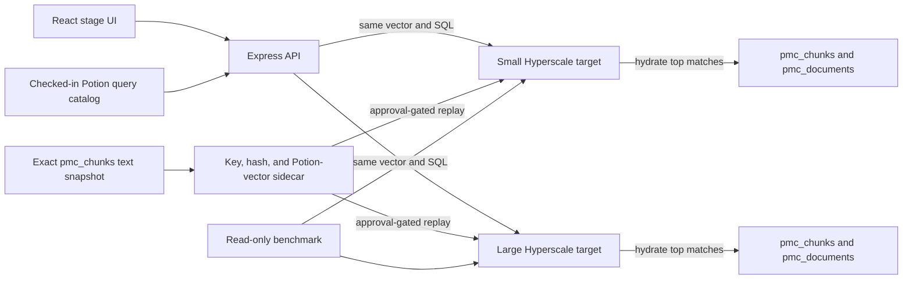

# Caldova Potion 512 demo app

Caldova is the stage application for the Demo 2 thesis:

> Start small. Scale without re-architecting.

The React application sends the same precomputed query vector and parameterized `VECTOR_SEARCH` statement to independent small and large Azure SQL Database Hyperscale targets. Potion vectors live in a narrow sidecar keyed to `dbo.pmc_chunks`; result text and article metadata remain in `dbo.pmc_chunks` and `dbo.pmc_documents`. Live mode is fail-closed. If the exact Potion contract, 1,000-row source-verified sidecar, and online version 3 cosine index are not all present, the app shows its labeled offline rehearsal fixture and leaves latency blank.

No live Potion latency measurements have been recorded yet. Do not infer them from the fixture or from historical 384-dimensional assets.

## Frozen contract

| Field | Required value |
|---|---|
| Schema | `caldova-pmc-potion512-v1` |
| Model | `minishlab/potion-retrieval-32M` |
| Runtime | `model2vec==0.9.0` |
| Vector | 512 finite `float32` components |
| Distance | Cosine |
| Stage query | `prognostic and therapeutic biomarkers in type 2 papillary renal cell carcinoma` |
| Query-vector SHA-256 | `67736eba0e1d9ed6fb25fe0942456b31065ef3b8890ef90487af3ba735283d9d` |
| Source snapshot | 1,000 `dbo.pmc_chunks` rows; 88 from `PMC10022194` |
| Source JSONL SHA-256 | `c2053617ccacd682d83e1af93b18e7e462b625feb3e3f4d5dfc90d477af48460` |
| Canonical sidecar | 1,000 rows, 11,039,758 bytes |
| Sidecar SHA-256 | `060aca3570824a4df1cb8fc518253e3bd3ff4478b44a2621ccb4d2e07b0dc1cc` |

Existing 384-dimensional data remains isolated. The text in `dbo.pmc_chunks.text_chunk` is the canonical Potion input, but its existing 512-dimensional `embedding` column is not Potion and is never read, overwritten, converted, or presented as Potion evidence. Matching dimensions do not establish model provenance.

## Architecture



The Vite development server proxies `/api` to Express. After `npm run build`, Express serves both the static app and API from one local process.

## Run locally

From this directory:

```bash
npm install
npm run build
npm start
```

Open `http://127.0.0.1:8000`. With no database configuration, the app runs in rehearsal mode. `GET /api/health` does not connect to Azure SQL.

For live development, run these in separate terminals:

```bash
npm run dev:api
npm run dev
```

Open the Vite URL, normally `http://127.0.0.1:5173`.

## Rebuild and validate artifacts

From the parent `keynotedemo2` directory:

```bash
source .venv/bin/activate
python -m pip install -r requirements-potion512.txt
python database/export_pmc_potion_source.py
python database/generate_potion_query_vectors.py
python database/generate_potion_corpus.py
python database/generate_potion_rehearsal_fixture.py
python database/validate_potion_artifacts.py
```

The exporter performs only a parameterized `SELECT` against `vbench_large`, includes every live chunk for `PMC10022194`, and fills the remainder by lowest source key. It writes immutable local files. The validator checks model/runtime identity, cosine distance, vector shape and finiteness, exact source keys and hashes, duplicate hashes, and package bytes. A changed hash is a new artifact and requires review; do not silently update this runbook.

## Configure live targets

Export the variables shown in `.env.example` before starting the API:

```bash
export AZURE_SQL_SMALL_SERVER='<independent-small-server>.database.windows.net'
export AZURE_SQL_SMALL_DATABASE='<small-database>'
export AZURE_SQL_LARGE_SERVER='vbnech-large-server.database.windows.net'
export AZURE_SQL_LARGE_DATABASE='vbench_large'
```

The API does not load env files automatically. To keep local values in an ignored file, source that file into the shell before running `npm start` or `npm run dev:api`.

Do not rename `vbench_large`. The small and large benchmark targets must be independent server/database pairs. Local operations use the Azure CLI credential; hosted deployment should use a least-privilege managed identity assigned to `CaldovaSearchReader`.

## Approval-gated database sequence

These steps mutate Azure SQL and require explicit approval for each named target. They have not been run for the Potion lane.

1. Confirm the target has compatible `dbo.pmc_chunks` and `dbo.pmc_documents` source tables containing the exact snapshot keys and text. Apply [05-potion512-schema.sql.template](../database/05-potion512-schema.sql.template) to one approved target using a reviewed copy with `@DeploymentApproved = 1`.
2. Run the loader without `--apply`. This validates local bytes without opening a network connection. If the target is configured, it also prints the exact confirmation phrase; otherwise it reports `targetConfigured: false` and no apply command.
3. Run the printed command only after confirming the target, 1,000 rows, and payload SHA. The serializable transaction replaces rows only in `dbo.CaldovaPotionEmbedding`. Every input row must match the current `pmc_chunks` primary key and UTF-16LE text hash; full sidecar read-back follows, and any mismatch rolls back.
4. Apply [06-create-potion512-vector-index.sql.template](../database/06-create-potion512-vector-index.sql.template) using the same approval process.
5. Run the read-only [07-validate-potion512-target.sql](../database/07-validate-potion512-target.sql) and the benchmark readiness checks.
6. Repeat independently for the second approved target.

Validation-only loader example:

```bash
npm run load:potion -- --environment small
```

Mutation requires both `--apply` and the exact printed `--confirm` value. A wrong value stops before token acquisition. Never point the loader at a target whose `dbo.CaldovaPotionEmbedding` contents are not approved for replacement. The loader never inserts, updates, or deletes `dbo.pmc_chunks`.

## Benchmark

The benchmark is read-only and defaults to three warm-ups plus 20 measured searches per target:

```bash
npm run benchmark:potion -- \
  --environment both \
  --warmup 3 \
  --runs 20 \
  --output ../evidence/potion-benchmark-YYYYMMDD.json
```

The output path must not already exist. Before measuring, the harness refuses any target that does not have:

- an independent server/database identity;
- the exact schema and embedding contract;
- exactly 1,000 rows with 1,000 distinct content and embedding hashes;
- zero missing source keys and zero current source-text hash mismatches;
- a corpus fingerprint equal to the canonical local package; and
- exactly one online version 3 cosine vector index.

`sqlMs` is measured inside SQL around the forced-ANN retrieval. `totalMs` is measured in Node around the database request after the connection pool is ready. The report retains warm-ups, every raw sample, median, p95, evidence rows, and small/large deltas. It does not measure resume or cold-start latency.

Only a retained report from the final stage targets can support performance wording. The UI's single live result is a visual diagnostic, not the benchmark claim.

## Commands

| Command | Purpose |
|---|---|
| `npm run build` | Typecheck server, scripts, and client; build static assets |
| `npm run lint` | Run repository lint rules |
| `npm start` | Serve the built app and API on `127.0.0.1:8000` |
| `npm run load:potion -- --environment small` | Validate a load package without connecting |
| `npm run benchmark:potion` | Validate and measure both configured live targets |

The focused execution plan is in [potion512-demo-plan.md](../potion512-demo-plan.md); the timed stage narration and fallback cues are in [potion512-stage-script.md](../potion512-stage-script.md).
